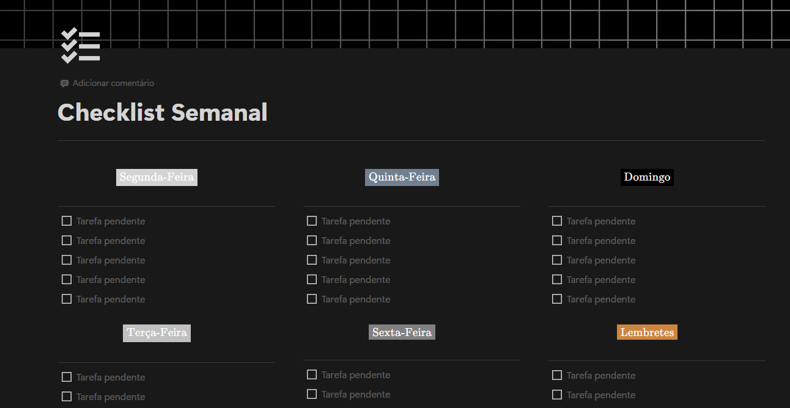

#  **Notion Routine Automator**

> Automatize e organize seu checklist semanal e tabela de hábitos no Notion com Python.


## ⚙️ Sobre o Projeto

Este script em Python automatiza o fluxo de uma **página semanal do Notion**, focado em duas funcionalidades principais:

1. **Organização de tarefas pendentes**  
   Busca automaticamente todos os checkboxes não marcados da semana e os reorganiza ao final da página em uma nova seção chamada `Atividades Restantes`.

2. **Processamento de Tabela de Hábitos**  
   Analisa a tabela localizada no fim da página, calculando totais e médias com base em parâmetros como:
   - Ingestão de água (💧)  
   - Horas de sono (💤)  
   - Prática de atividade física (🏋️‍♂️)

## 💻 Como Executar Localmente

### 1. Pré-requisitos

- [Python 3.8+](https://www.python.org/downloads/)
- Conta no [Notion](https://www.notion.so/)
- Token de integração com a [API do Notion](https://developers.notion.com/reference/create-a-token)

### 2. Clonando o repositório

```bash
git clone https://github.com/ja1steinert/notion-scripts.git
cd notion-scripts
```

### 3. Criando o ambiente virtual (opcional, mas recomendado)

```bash
python -m venv venv
source venv/bin/activate  # ou venv\Scripts\activate no Windows
```

### 4. Instalando dependências

```bash
pip install -r requirements.txt
```

### 5. Como conectar o Notion à automação

1. **Duplique o template da página**  
   🔗 [Checklist Semanal - Template](#)  
   - Abra o link e clique em **“Duplicar”** no canto superior direito  
   - Mais detalhes: [Como duplicar páginas públicas no Notion](https://www.notion.so/help/duplicate-public-pages)

2. **Crie uma integração com a API do Notion**  
   🔗 [Criar nova integração](https://www.notion.so/profile/integrations/form/new-integration)  
   - Dê um nome (ex: `Automation`)
   - Selecione o workspace correto
   - Marque todas as permissões de **funções de conteúdo** e **comentários**
    - Mais detalhes: [Criando uma integração no Notion](https://developers.notion.com/docs/create-a-notion-integration)

3. **Adicione o token da integração ao script**  
   - Na página da integração, clique em **“Exibir”** para revelar o campo `Segredo de integração interna`
   - Copie o token fornecido
   - Abra o arquivo `.env` e cole o token no seguinte formato:
     ```env
     NOTION_TOKEN=coloque_seu_token_aqui
     ```

4. **Conecte a integração à sua página duplicada**  
   - Acesse a página duplicada do template  
   - Clique no ícone de **três pontos (`⋯`)** no canto superior direito  
   - Selecione a opção **“Conexões”**
   - Escolha a integração que você criou anteriormente

### 6. Rodando o script

```bash
python main.py
```

### 7. Compartilhe o link da página com o script

Ao rodar o script pela primeira vez, será solicitado que você **cole o link da página do Notion** (aquela que você duplicou a partir do template).

> Isso é necessário para que o script consiga extrair automaticamente o `page_id` e interagir com a página via API.

Certifique-se de que a página esteja conectada à integração (conforme descrito na etapa 5).

## 🔧 Tecnologias Utilizadas

- Python 3
- [notion-client](https://github.com/ramnes/notion-sdk-py)